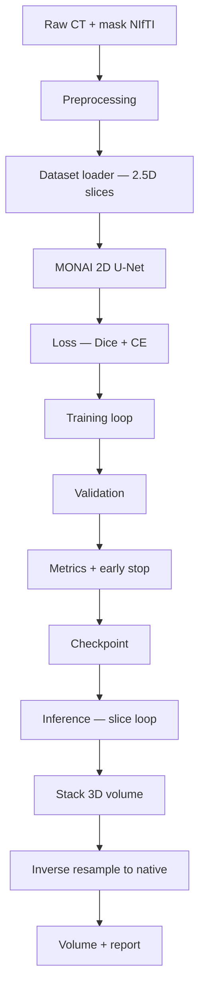

# Training Pipeline Design — BHSD (Phase 2)

> **Status: Approved and Frozen**  
> V1 MONAI 2.5D recipe locked for baseline comparison. Kept for thesis reviewers.

**Project:** BrainHemorrhageAI  
**Dataset:** BHSD labeled set (`label_192`) — 192 CT volumes, 6-class segmentation (0–5)  
**Status:** Approved and Frozen (2.5D + MONAI 2D U-Net as Version 1 baseline)  
**Depends on:** `data_split_design.md`, `resampling_design.md`, `windowing_normalization_design.md`, `model_design.md`  
**Hardware context:** AMD Ryzen 5 7535U · 16 GB RAM · no local NVIDIA CUDA · Kaggle GPU optional  
**Last updated:** Phase 2 milestone (freeze banner added during V2 Phase A cleanup)

---

## Executive summary

**Version 1 training approach (approved):** **2.5D segmentation** — three adjacent axial slices as input channels, **2D U-Net** (MONAI) predicting the **center-slice** multi-class mask.

**Input spatial resolution:** **Under evaluation** — not locked to 256×256 (see Current Decision Status).

**Deferred:** Full **3D** training (Research Version / GPU access); pure **2D** single-slice (acceptable ablation, not primary).

This document defines the complete path from raw CT to checkpoint and 3D inference reconstruction.

---

## Current Decision Status

The training strategy (**2.5D + MONAI 2D U-Net**) has been **approved**.

However, the **final input resolution remains under evaluation**.

### Candidate resolutions

- **512 × 512** — native in-plane after resampling (~512 or ~250 depending on resample target)
- **256 × 256** — downsampled full slice
- **ROI-based cropping** around the brain (bounding box with margin)

### Selection criteria (analysis required before locking)

- Hemorrhage **bounding box sizes** (from train-set masks)
- **Brain occupancy** within each slice (skull vs FOV)
- **Memory requirements** (local CPU vs Kaggle GPU)
- **Inference speed** (clinical async workflow)
- **Segmentation accuracy** (val Dice per subtype, especially EDH/SAH)

The final resolution will be documented in this file and `model_design.md` once analysis is complete. **Version 1 does not permanently use 256×256** until explicitly approved.

---

## Why this milestone matters

Training pipeline design determines whether the project can **actually run** on available hardware while producing **clinically useful 3D segmentations**. Wrong choices (full-volume 3D on CPU, no slice reconstruction plan) block the entire Version 1 goal: upload CT → segmentation → native-space volume → report.

| Stakeholder need | Pipeline decision that serves it |
|------------------|----------------------------------|
| Research / thesis | Reproducible split, metrics, checkpoint policy |
| Local development | CPU-feasible 2.5D + small batches |
| Kaggle / cloud burst | Same code path with larger batch on GPU |
| Clinical product | Full 3D volume output via slice stacking + inverse resample |
| Future nnU-Net | Same preprocessing; swap model block |

---

## 1. Comparison: 2D vs 2.5D vs 3D segmentation

### 2D (single axial slice)

| Aspect | Description |
|--------|-------------|
| **Input** | One slice `(H, W)` or `(1, H, W)` |
| **Output** | Segmentation of that slice |
| **Context** | None through-plane |
| **Model** | 2D U-Net, DeepLab, etc. |
| **Literature** | Common when GPU/memory limited; slice-wise brain hemorrhage papers |

### 2.5D (multi-slice input, 2D network)

| Aspect | Description |
|--------|-------------|
| **Input** | `k` adjacent slices stacked as channels `(k, H, W)`, e.g. k=3 |
| **Output** | Segmentation of **center slice** only |
| **Context** | Limited z-context without 3D convolutions |
| **Model** | 2D U-Net with k input channels |
| **Literature** | Standard compromise in anisotropic CT (thick slices) |

### 3D (volumetric)

| Aspect | Description |
|--------|-------------|
| **Input** | Full volume or 3D patch `(1, D, H, W)` |
| **Output** | 3D segmentation mask |
| **Context** | Full spatial context in x, y, z |
| **Model** | 3D U-Net, V-Net, nnU-Net 3D, SwinUNETR |
| **Literature** | SOTA on GPU; nnU-Net default for multi-site CT |

---

## 2. Comparison for BHSD specifically

Phase 1 findings relevant to training mode:

| BHSD property | Implication for 2D | Implication for 2.5D | Implication for 3D |
|---------------|--------------------|------------------------|---------------------|
| **192 scans** | Feasible; risk overfitting | Feasible; more signal per step | High overfitting + compute risk |
| **512×512 in-plane** | Large; need 256² crop/resize | Same | Needs patches at 256³ or smaller |
| **24–60 slices depth** | Many slices per volume | ~24–60 training samples per scan | Variable D breaks batching without resample |
| **Anisotropic z (~5 mm)** | Each slice independent | Neighbors far apart but still useful | z-upsampling needed if isotropic resample |
| **Multi-class 1–5** | Works; rare EDH needs sampling | Same | Best theoretical subtype context |
| **Class imbalance** | Hemorrhage-aware slice sampling critical | Same | Same + weighted loss |
| **Multi-label scans** | Model sees co-occurring subtypes per slice | Same | Same across volume |

**BHSD-specific conclusion:** Pure 2D ignores through-plane cues (SDH crescent, IVH in ventricles). Full 3D is ideal geometrically but **incompatible with Version 1 hardware budget**. **2.5D is the best fit** for anisotropic brain CT with 192 cases and CPU-first development.

---

## 3. Multi-criteria analysis

### Accuracy (expected relative ranking)

| Mode | Expected segmentation quality | Notes |
|------|------------------------------|-------|
| **3D** | Highest potential | Captures z-continuity; best for small connected SAH/IVH |
| **2.5D** | **Strong baseline** | Most hemorrhage papers within ~2–5% Dice of 3D on CPU budgets |
| **2D** | Lowest | Misses continuity; more false positives on partial slices |

For BHSD with thick slices, 2.5D recovers much of 3D benefit at fraction of cost.

### GPU memory (typical training step)

| Mode | Approximate tensor | VRAM (indicative) |
|------|-------------------|-------------------|
| **2D** 256² batch 8 | `(8, 1, 256, 256)` | **~2–4 GB** |
| **2.5D** 256² batch 8, k=3 | `(8, 3, 256, 256)` | **~4–8 GB** |
| **3D** patch 128³ batch 2 | `(2, 1, 128, 128, 128)` | **~12–24 GB** |
| **3D** full 512×512×32 | Infeasible | **>40 GB** |

Kaggle T4 (16 GB): comfortable for **2.5D**; tight for 3D patches; full 3D impossible.

### CPU feasibility (local laptop)

| Mode | Verdict |
|------|---------|
| **2D** | **Yes** — minutes per epoch with small U-Net |
| **2.5D** | **Yes** — ~3× 2D cost; primary local path |
| **3D** | **Impractical** — days per epoch; not Version 1 |

### Kaggle GPU feasibility

| Mode | Verdict |
|------|---------|
| **2.5D** | **Recommended** — fast iteration, batch 8–16 |
| **3D patch** | Possible for experiments; not default pipeline |
| **Full 3D** | No |

Same MONAI training script; swap device and batch size via config.

### Inference speed (single CT, ~30–40 slices)

| Mode | Process | Latency (order of magnitude) |
|------|---------|------------------------------|
| **2D** | 1 forward pass per slice | **~5–15 s CPU** / **~1–3 s GPU** |
| **2.5D** | 1 forward pass per slice (3 slices read) | **~8–20 s CPU** / **~2–5 s GPU** |
| **3D** | 1–few patch forwards + stitch | GPU: seconds–minutes; CPU: minutes+ |

2.5D inference is acceptable for clinical async upload workflow (not real-time fluoroscopy).

### Clinical usefulness

| Mode | 3D report | Subtype volumes | Overlay |
|------|-----------|-----------------|---------|
| **2D** | Reconstruct by stacking slice preds | Yes (native inverse map) | Full axial series |
| **2.5D** | Same | Yes | Same; often smoother z continuity |
| **3D** | Native | Yes | Best z consistency |

All modes can produce **full 3D volume** if slice predictions are stacked (Sections 9). Clinical mL uses **native spacing** regardless of training mode.

---

## 4. Version 1 recommendation — ONE approach

### **2.5D axial segmentation with MONAI 2D U-Net**

| Parameter | Value |
|-----------|-------|
| **Input** | 3 consecutive axial slices → **3 channels** |
| **Output** | Multi-class mask for **center slice** (labels 0–5) |
| **Architecture** | MONAI `UNet` (2D), 3 input channels, 6 output classes |
| **Spatial size** | **TBD** — e.g. 512×512, 256×256, or brain ROI crop (see Current Decision Status) |
| **Slice sampling** | **Balanced:** ~50% slices with hemorrhage, ~50% background-only (train) |
| **Inference** | Sliding axial window (each slice as center once) → stack → optional inverse resample to native grid |

**Why this is optimal for Version 1:**

1. Matches **anisotropic BHSD** — radiologists read axially; thick z makes 3D conv expensive for limited gain on CPU  
2. **Runs locally** on CPU for debugging; scales to **Kaggle GPU** without pipeline rewrite  
3. **192 scans** — simpler model + 2.5D reduces overfitting vs 3D with millions of parameters  
4. **MONAI** aligns with `PROJECT_CONTEXT.md` and future DynUNet/nnU-Net migration  
5. **Full 3D clinical output** still achieved via slice reconstruction + native volume mapping  
6. Proven pattern in brain hemorrhage and stroke segmentation literature when 3D GPU is unavailable  

---

## 5. Why other approaches are deferred

### Pure 2D — deferred as primary (not forbidden)

| Reason | Detail |
|--------|--------|
| Less context | Subdural crescents and ventricular blood benefit from adjacent slices |
| Minimal compute savings vs 2.5D | 3 channels vs 1 — small overhead |
| Use case | **Ablation baseline** — train 2D to quantify value of z-context in thesis |

### Full 3D — deferred to Research Version

| Reason | Detail |
|--------|--------|
| **No local CUDA** | CPU 3D training impractical |
| **16 GB RAM** | Full volumes don't fit; patches add stitching complexity |
| **192 scans** | 3D models overfit; need heavy augmentation + regularization |
| **Resampling pending** | 3D patch grid locks spacing decision more aggressively |
| **Upgrade path** | After 2.5D baseline + Kaggle/nnU-Net GPU run |

### nnU-Net / SwinUNETR native 3D — deferred

Requires GPU pipeline and auto-configuration pass; planned after Version 1 baseline metrics exist for comparison.

---

## 6. Complete training pipeline



### Stage-by-stage definition

#### 1. Raw CT

- Source: `data/raw/label_192/images/` + `ground truths/`
- Split: `data/metadata/splits.csv` (70/15/15 stratified)
- Never apply augmentations before split assignment

#### 2. Preprocessing

Per `windowing_normalization_design.md` and `resampling_design.md`:

```text
Load native CT + mask
→ Store native spacing / affine (manifest)
→ HU clip/window (values TBD)
→ Z-score (train μ, σ)
→ Resample (when approved; CT linear, mask nearest)
→ Cache to data/processed/
```

Preprocessing runs **once offline**; training reads cached volumes.

#### 3. Dataset loader

- **Training:** sample `(slice i-1, slice i, slice i+1)` CT + mask at slice `i`
- **Edge slices:** replicate boundary slice or skip outermost indices
- **Train sampling:** hemorrhage-aware (prefer slices with label > 0)
- **Val/test:** **all slices** sequentially (no balanced sampling — unbiased metrics)
- Output tensor shapes (resolution **TBD**):
  - `image`: `(3, H, W)` float32 — e.g. `(3, 256, 256)` or `(3, 512, 512)`
  - `label`: `(H, W)` int64

#### 4. Model

- **MONAI 2D U-Net**
- `spatial_dims=2`, `in_channels=3`, `out_channels=6`
- Depth: start shallow (e.g. 3 levels) for 192-scan dataset — avoid overparameterization
- Activation: softmax at inference; logits at training

#### 5. Loss

- **Dice + Cross-Entropy** (`DiceCELoss`) — MONAI standard for multi-class segmentation
- **Class weights:** upweight rare classes (especially **EDH = 1**) derived from train set voxel frequencies
- Ignore background-only slices? **No** — background slices teach negative class

#### 6. Validation

- Run every **N epochs** (e.g. 1) on full val set (29 scans, all slices)
- **Early stopping** on **mean Dice (classes 1–5)** or **macro Dice** — not background Dice
- No test set during training (split freeze policy)

#### 7. Metrics

| Metric | Purpose |
|--------|---------|
| **Per-class Dice (1–5)** | Subtype segmentation quality |
| **Mean hemorrhage Dice** | Primary model selection |
| **Macro Dice (1–5)** | Balanced view across rare classes |
| **Volume error (mL)** | Optional val — native-space pred vs GT (Phase 1 pipeline) |

Log to `reports/training/` (CSV/JSON per epoch).

#### 8. Checkpoint

- Save: `checkpoints/best_model.pt` (val mean hemorrhage Dice)
- Save: `checkpoints/last_model.pt`
- Include: model weights, optimizer state, epoch, `preprocess_config.json` hash, split manifest hash

#### 9. Inference (training pipeline output)

See Section 9 (3D reconstruction).

---

## 7. Patch-based vs full-image training

### Full-image (whole slice)

| | |
|---|---|
| **Description** | Resize or pad entire 512×512 axial slice to 256×256 |
| **Pros** | Simple; global context; easy inference (one pass per slice) |
| **Cons** | Hemorrhage is tiny — class imbalance within slice |

### Patch-based (random crops)

| | |
|---|---|
| **Description** | Random 256×256 crops; oversample crops containing hemorrhage |
| **Pros** | **Forces model to learn small structures**; better for EDH/SAH |
| **Cons** | More complex loader; inference requires **sliding window + stitch** |

### Version 1 recommendation (resolution pending)

**Train: full-slice or brain ROI** (exact H×W **TBD**) **+ hemorrhage-aware slice selection** (not random patch) — unless ROI analysis favors patch-based training.

**Rationale:**

- Hemorrhage-aware **slice** sampling balances positives/negatives  
- Full-slice or ROI inference should match training geometry — avoid stitch complexity in v1  
- **256×256** and **512×512** remain candidates until bounding-box and memory analysis completes  

**Research Version:** random crops centered on hemorrhage if full-slice EDH Dice insufficient.

---

## 8. Batch size considerations

| Environment | Batch size | Notes |
|-------------|------------|-------|
| **Local CPU** | **2–4** (adjust for H×W) | 2.5D × float32; lower batch at 512² |
| **Kaggle T4 GPU** | **4–16** (resolution-dependent) | 512² → smaller batch; 256² → 8–16 |
| **Gradient accumulation** | **2–4 steps** | Simulate larger batch on CPU if needed |

**Rules:**

- Batch size affects BatchNorm — use **GroupNorm or InstanceNorm** if batch < 4 (MONAI U-Net config option)
- Document batch size in every experiment log for reproducibility
- Do not change batch size between val comparisons without noting effective batch (accumulation)

---

## 9. Reconstructing full 3D volume from 2.5D predictions

Training predicts **one axial slice at a time**. Inference must rebuild the full volume:

### Inference algorithm

```text
For each axial index i in preprocessed volume:
    Build input [slice i-1, slice i, slice i+1]  (replicate edges)
    Forward pass → logits (6, H, W)
    Argmax → pred_mask[:, :, i]

Stack all pred_mask[:, :, i] → pred_volume (H, W, D)
```

### Post-processing

1. **Optional:** remove small connected components per class (configurable min voxels)
2. **Inverse resample** `pred_volume` to **native grid** (nearest neighbor) using stored affine/spacing
3. **Volume calculation** on native grid with **original spacing** (`calculate_volume.py` logic)
4. **Overlay generation** for web viewer (native or display grid — inference design doc)

### Consistency guarantee

- Same preprocessing chain as training (clip, z-score, resample params from `preprocess_config.json`)
- Same 2.5D windowing at inference
- Slice `i` always uses itself as **center channel**

---

## 10. Final recommendation table

| Decision | Version 1 choice | Reason |
|----------|------------------|--------|
| **Training dimensionality** | **2.5D** | Best accuracy/CPU tradeoff for anisotropic BHSD |
| **Architecture** | **MONAI 2D U-Net** (3 in, 6 out) | Project stack; proven; CPU/GPU portable |
| **Input channels** | **3** (adjacent axial slices) | Minimal z-context without 3D conv |
| **Output** | **Center-slice 6-class mask** | Matches 2.5D training target |
| **Spatial size** | **Under evaluation** (512² / 256² / brain ROI) | See Current Decision Status |
| **Training regions** | **Full slice** (not patches) | Simpler inference; slice sampling balances classes |
| **Slice sampling (train)** | **~50% hemorrhage / 50% background** | Mitigates foreground sparsity |
| **Slice sampling (val/test)** | **All slices** | Unbiased evaluation |
| **Loss** | **DiceCE + class weights** | Multi-class + imbalance |
| **Primary metric** | **Mean Dice (labels 1–5)** | Clinical subtypes matter |
| **Batch size (local)** | **2–4** | CPU feasible |
| **Batch size (Kaggle)** | **8–16** | GPU utilization |
| **Normalization in network** | **GroupNorm** if batch ≤ 4 | Stable small batches |
| **3D output** | **Stack slice preds → inverse resample** | Full volume for report |
| **Volume spacing** | **Native (locked)** | Clinical correctness |
| **Pure 2D** | **Deferred** (ablation) | Less context |
| **3D U-Net / nnU-Net** | **Deferred** (Research Version) | GPU + complexity |
| **5-fold CV** | **Deferred** (Research Version) | Per split design doc |

---

## Approval checklist (before training implementation)

- [x] 2.5D + MONAI 2D U-Net approved  
- [ ] **Input resolution selected** (bounding-box / memory analysis)  
- [ ] Preprocessing + resampling finalized  
- [ ] HU clip values documented with references  
- [ ] `splits.csv` generated and frozen  
- [ ] Checkpoint and metrics schema defined  
- [ ] Inference 3D reconstruction procedure reviewed  

---

## Related documents

- `docs/architecture/data_split_design.md`
- `docs/architecture/resampling_design.md`
- `docs/architecture/windowing_normalization_design.md`
- `docs/architecture/model_design.md` — MONAI 2D U-Net specification
- Phase 1: `src/research/calculate_volume.py` — native-space volume reference

---

*Next milestone: literature review for HU clip; approve resampling; implement preprocessing and dataset loader per this pipeline.*
