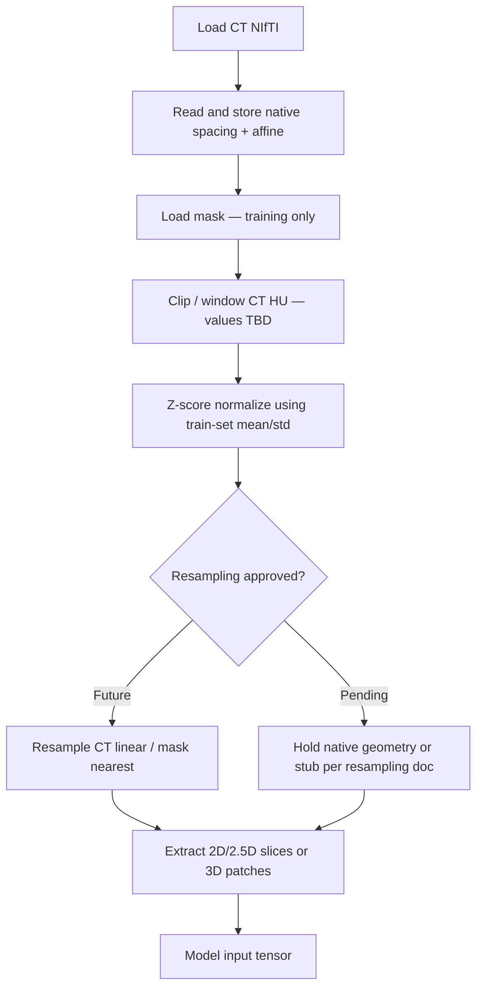

# Windowing & Normalization Design — BHSD (Phase 2)

> **Status: Approved and Frozen**  
> Implementation locked in `config/preprocessing.yaml` and literature review. Kept for thesis reviewers.

**Project:** BrainHemorrhageAI  
**Dataset:** BHSD labeled set (`label_192`) — 192 CT volumes  
**Status:** Approved and Frozen (HU clip/normalize locked for V1 MONAI pipeline)  
**Depends on:** Phase 1 analysis, `resampling_design.md` (target spacing pending)  
**Last updated:** Phase 2 milestone (freeze banner added during V2 Phase A cleanup)

---

## Executive summary

This document defines how **CT intensity** is transformed before model input. The **preprocessing pipeline structure is approved**; specific HU clipping/window parameters remain under literature review.

**Approved pipeline order:**

```text
Load CT (HU, native spacing metadata)
→ Windowing / HU clipping (values TBD)
→ Z-score normalization (train-set statistics)
→ [Resampling — pending architectural approval]
→ Model
```

**Locked policies:** Intensity preprocessing before the model; windowing before normalization; train-only normalization stats; **original HU values and native voxel spacing preserved** for clinical volume calculation.

---

## Current Decision Status

The preprocessing pipeline has been **approved**, but the exact HU clipping/window values remain **under evaluation**.

### Finalized

- CT images will undergo **intensity preprocessing** before entering the model.
- **Windowing/clipping will occur before normalization.**
- **Normalization statistics will be computed from the training set only.**
- **Original CT values and voxel spacing will always be preserved** for clinical volume calculation.

### Under review

- Exact **HU clipping range** (e.g. `[0, 80]`, `[0, 100]`, `[-100, 200]`).
- **Window level / window width** (e.g. brain 40/80 vs subdural 75/200).
- Whether **one fixed brain window** or **multiple windows** (e.g. dual-channel brain + subdural) should be used.

The **final clipping values will be selected after reviewing brain hemorrhage segmentation literature** and will be documented in this file with **supporting references** before preprocessing implementation begins.

**Leading candidates (not approved):** brain window WL=40/WW=80 (≈ `[0, 80]` HU clip); wider hemorrhage clip `[0, 100]` HU — see Sections 4 and 6 for analysis.

---

## Why this milestone matters

### Importance

CT voxels are **Hounsfield Units**, not RGB pixels. Feeding raw HU into a CNN without windowing forces the network to spend capacity learning:

- Which intensities are irrelevant (air, bone)
- How to map 4000+ HU dynamic range into useful contrast
- Scanner-specific intensity shifts

Windowing and normalization convert CT into a **stable, learnable signal** — the same role ImageNet normalization plays for natural images, but grounded in **physical attenuation units**.

### Contribution to the final system

| Component | Dependency on this design |
|-----------|----------------------------|
| **Segmentation model** | Input tensor intensity range and statistics |
| **Training convergence** | Stable gradients; consistent batch statistics |
| **Inference API** | Same transform on uploaded scans as training |
| **Clinical report** | Indirect — better segmentation → better masks → native-space volume |
| **Resampling decision** | Clipping in HU **before** resample is standard; resample target may depend on training mode |

### Multiple valid approaches

| Approach | Used when |
|----------|-----------|
| Fixed brain window | Reproducible baselines; production deployment |
| Adaptive / percentile window | Heterogeneous acquisition; research exploration |
| Clip only (no display window) | Simple deep learning pipelines |
| Z-score vs min-max | Dataset-wide vs bounded [0,1] inputs |

**One pipeline is recommended below** for Version 1 — optimized for BHSD hemorrhage segmentation, CPU training, reproducibility, and alignment with medical imaging practice.

---

## 1. What are Hounsfield Units (HU)?

**Hounsfield Units** quantify X-ray attenuation in CT relative to water and air:

| Material | Approximate HU |
|----------|----------------|
| Air | −1000 |
| Water | 0 |
| Soft tissue / brain parenchyma | **20–40** |
| Acute hemorrhage | **+40 to +90** (hyperdense) |
| Chronic hemorrhage / fluid | lower |
| Bone / skull | **+400 to +1000+** |

HU is **absolute and scanner-calibrated** (within protocol limits). Unlike JPEG brightness, HU **40** in one non-contrast head CT is comparable to **40** in another — enabling standardized windowing.

BHSD stores CT as NIfTI; `nibabel` loads values as HU (via slope/intercept in header if present). Phase 1 confirmed float data suitable for HU-based processing.

---

## 2. Why CT images require windowing

Radiologists never interpret the full HU range at once. They apply a **window** (center + width) to map a HU interval to display grayscale — analogous to histogram stretching on a subset of intensities.

For neural networks, windowing:

- **Suppresses irrelevant structures** (skull, table, air outside FOV)
- **Amplifies contrast** in the tissue range where hemorrhage appears
- **Reduces effective dynamic range** → easier optimization
- **Matches clinical viewing** — model sees what experts use to detect bleeds

Without windowing, bone voxels dominate gradient magnitude and hemorrhage signal is a tiny fraction of the intensity histogram.

---

## 3. Why raw CT should not be fed directly into a neural network

| Problem | Effect |
|---------|--------|
| **Extreme dynamic range** | Air (−1000) to bone (+1000+) in one volume; softmax/CNN activations saturated |
| **Class-irrelevant intensities** | Skull edge artifacts confuse boundary learning |
| **Slow convergence** | Network learns intensity calibration instead of anatomy |
| **Train/serve skew** | Upload scans with different reconstruction kernels shift raw histograms |
| **Inconsistent with literature** | Benchmarks (hemorrhage segmentation, nnU-Net) universally preprocess HU |

Raw HU input is occasionally tested in research; for a **production hemorrhage system**, it is inferior to windowing + normalization without meaningful upside.

---

## 4. Common brain CT window settings

Radiology and ML literature use named presets (center = WL, width = WW):

### Brain window

| Parameter | Typical value |
|-----------|---------------|
| Center (WL) | **40 HU** |
| Width (WW) | **80 HU** |
| Visible range | **0 to 80 HU** (approximately) |

**Use:** Gray matter, white matter, **acute intracranial hemorrhage** (hyperdense vs parenchyma).  
**Primary choice for BHSD** — hemorrhage subtypes (EDH, SDH, SAH, IPH, IVH) are diagnosed on brain windows in clinical practice.

### Subdural / stroke window (soft-tissue emphasis)

| Parameter | Typical value |
|-----------|---------------|
| Center | **75–80 HU** |
| Width | **130–200 HU** |
| Visible range | roughly **0–150 HU** |

**Use:** Subtle **subdural** collections, early ischemia, soft-tissue contrast at brain–skull interface.  
**When useful:** SDH at convexity can be subtle on standard brain window; some hemorrhage papers use wider soft-tissue windows.  
**Tradeoff:** More skull and noise; less specific for general brain parenchyma.

### Bone window

| Parameter | Typical value |
|-----------|---------------|
| Center | **400–600 HU** |
| Width | **1800–2000 HU** |

**Use:** Fractures, skull base, calvarium.  
**Not appropriate for BHSD segmentation** — hemorrhage is soft-tissue pathology; bone window suppresses parenchyma contrast needed for IPH/IVH/SAH.

### Comparison summary

| Window | Hemorrhage visibility | Skull influence | BHSD suitability |
|--------|----------------------|-----------------|------------------|
| Brain (40/80) | Excellent for acute blood | Low inside brain | **Primary** |
| Subdural (75/200) | Good for subtle SDH | Moderate | Optional ablation |
| Bone (600/2000) | Poor for parenchyma bleeds | Dominant | **Exclude** |

---

## 5. Fixed vs adaptive windowing

### Fixed windowing

Apply the **same WL/WW or HU clip** to every scan.

| Pros | Cons |
|------|------|
| Fully **reproducible** | Suboptimal for outlier acquisitions |
| Identical **train and inference** logic | May underexpose extreme cases |
| Easy to **document and audit** | Less robust to severe scanner drift |
| Standard in **production ML** | |

**Research usage:** Default in most MICCAI segmentation papers; nnU-Net uses dataset-specific clipping derived once from training set (related to fixed global clip).

### Adaptive windowing

Adjust WL/WW per scan — e.g. from histogram percentiles, foreground ROI, or automated brain extraction.

| Pros | Cons |
|------|------|
| Handles **scanner variability** | **Non-reproducible** if ROI detection fails |
| Can improve **subtle SDH** on difficult scans | Train/serve mismatch if inference ROI differs |
| Used in some **research** hemorrhage detection papers | Harder to explain clinically |

**Research usage:** More common in classification than dense segmentation; often paired with skull stripping.

### Recommendation direction

**Fixed windowing for Version 1** — aligns with production readiness and thesis reproducibility. Adaptive methods reserved for ablation studies in Research Version.

---

## 6. Intensity clipping

### Why clipping is performed

Windowing can be implemented as:

```text
clip(low, high)  then  linear scale to model range
```

Clipping **hard-limits** HU before normalization:

- Removes **outlier voxels** (metal, beam hardening spikes)
- Guarantees **bounded input** regardless of reconstruction
- Simpler than per-slice WL/WW display math for DL pipelines

Equivalent to brain window when `low=0, high=80` (or similar).

### Typical clipping ranges for brain hemorrhage CT

| Range (HU) | Rationale |
|------------|-----------|
| **[0, 80]** | Standard brain window; acute hemorrhage + parenchyma |
| **[0, 100]** | Slightly wider; includes hyperdense blood up to ~100 HU |
| **[-100, 200]** | Used in some papers; includes partial CSF/subdural low contrast |
| **[-1024, 1024]** | nnU-Net-style generous clip before percentile normalization |

For BHSD acute hemorrhage segmentation, literature and radiology practice support **clipping to approximately brain/hemorrhage range**, not full HU spectrum.

Specific clip bounds and WL/WW will be chosen after literature review (see **Current Decision Status**). Candidate ranges are documented above for evaluation only — **not locked**.

---

## 7. Normalization methods

After clipping, values must be scaled for neural network input.

### Min-max normalization

```text
x_norm = (x - clip_min) / (clip_max - clip_min)   →   [0, 1]
```

| Pros | Cons |
|------|------|
| Bounded output | Sensitive to clip choice |
| Simple deployment | **Per-volume** min-max breaks cross-scan consistency |
| Interpretable | Outliers within clip still affect scale |

### Z-score normalization

```text
x_norm = (x - mean) / std
```

Statistics computed on **training set** after clipping.

| Pros | Cons |
|------|------|
| **Standard in medical DL** (MONAI, nnU-Net variants) | Unbounded — may need clipping after norm |
| Handles **residual scanner shift** after windowing | Requires storing mean/std for inference |
| Stable gradients when stats are global | Wrong stats if train set not representative |

### Percentile normalization (nnU-Net style)

Clip global percentiles (e.g. 0.5–99.5) then z-score — common in automated pipelines.

| Pros | Cons |
|------|------|
| Robust to outliers | Extra computation; ties to full train set histogram |
| Strong benchmarks | Less transparent for clinical audit |

### Dataset / scale intensity (MONAI)

`ScaleIntensityRanged` with fixed `a_min`, `a_max`, `b_min`, `b_max` — equivalent to clip + min-max with fixed bounds.

### Most appropriate for BHSD

**Z-score normalization using train-split statistics, applied after HU clipping/windowing.**

Clip/window parameters are **under review** (see Current Decision Status). Normalization method is **approved**.

| Reason | Explanation |
|--------|-------------|
| BHSD multi-site spacing/geometry already variable | Intensity harmonization helps generalization |
| 192 scans — small data | Global train stats more stable than per-volume |
| MONAI ecosystem | `NormalizeIntensityd` pattern matches project stack |
| Reproducibility | Store `train_hu_mean`, `train_hu_std` in `preprocess_config.json` |
| Hemorrhage contrast | Windowing preserves blood–brain difference; z-score centers learning |

**Alternative acceptable for ablation:** min-max to `[0, 1]` after clip — simpler deployment; clip bounds still TBD.

---

## 8. Recommended preprocessing pipeline (this project)

**Order of operations** — intensity steps locked; resampling placement pending:



### Step-by-step

| Step | Operation | Status |
|------|-----------|--------|
| 1 | Load CT in **native HU** | Required |
| 2 | **Persist** native spacing, affine, shape | **Locked** (volume + inverse map) |
| 3 | Load segmentation mask (train/val/test) | Required for supervised training |
| 4 | **Clip / window CT** (HU range TBD) | **Under review** |
| 5 | **Z-score:** `(x - μ_train) / σ_train` on clipped values | **Approved** |
| 6 | **Resample** CT and mask | **Pending** — see `resampling_design.md` |
| 7 | Slice/patch extraction | Depends on 2D/2.5D/3D decision (training pipeline) |
| 8 | Augmentation (train only) | Separate training design; intensity aug = small HU shift |

### Masks

- **No HU windowing** on masks
- **No z-score** on masks
- Cast to integer; values `{0,1,2,3,4,5}` only
- Resample with **nearest neighbor** when resampling is applied

### Statistics computation rule

- Compute `μ_train`, `σ_train` from **training split only** (134 scans per `data_split_design.md`)
- **Never** include val/test voxels in normalization statistics — prevents leakage

---

## 9. Effects on model behavior

### Segmentation accuracy

- **Windowing** focuses the network on parenchyma and hyperdense blood → higher Dice on hemorrhage classes
- **Too-narrow clip** removes subtle SDH → hurts label 2
- **Too-wide clip** reintroduces skull edges → false positives near calvarium

### Generalization

- **Fixed clip + global z-score** applies identically to new uploads → consistent inference
- **Per-volume normalization** (rejected) hides scanner differences the model should tolerate via augmentation, not hidden scaling

### Model convergence

- Bounded, zero-centered inputs → faster loss decrease on CPU
- Without normalization, first layers adapt slowly to HU scale — wasted epochs on 192-scan dataset

### Inference consistency

- Store in `preprocess_config.json`:

```json
{
  "hu_clip_min": "<TBD — literature review>",
  "hu_clip_max": "<TBD — literature review>",
  "window_level": "<optional TBD>",
  "window_width": "<optional TBD>",
  "train_mean": "<computed from train split>",
  "train_std": "<computed from train split>"
}
```

- Inference applies **identical** clip and z-score before model forward pass
- Resampling (when approved) uses same parameters as training

---

## 10. Risks and mitigation

| Risk | Description | Mitigation |
|------|-------------|------------|
| **Loss of subtle hemorrhage** | Narrow clip hides hypodense or subtle SDH | Literature review before locking bounds; monitor SDH Dice; subdural window ablation in research |
| **Over-clipping** | Aggressive clip truncates high-HU acute blood | Validate candidates on visualization subset; document references |
| **Scanner variability** | Different kernels shift HU histogram | Fixed clip + train z-score + mild HU augmentation (±5–10) |
| **Domain shift** | External hospital uploads differ from BHSD | Document training domain; plan external validation; avoid per-scan adaptive norm in v1 |
| **Train stats leakage** | Val/test in μ/σ computation | Compute stats on **train split only** |
| **Clip before vs after resample** | Wrong order blurs HU semantics | **Always clip in native HU space before resampling** |
| **Metal / streak artifacts** | Spike HU values | Clip caps spikes; optional mild median filter (research only — defer v1) |

---

## 11. Final recommendation table (this milestone)

### Approved (locked)

| Decision | Choice | Reason |
|----------|--------|--------|
| **Input unit** | **Hounsfield Units (HU)** | Physical meaning; clinical standard |
| **Preprocessing required** | **Yes — before model** | Raw HU unsuitable for CNN |
| **Windowing before normalization** | **Yes** | HU clip/window in physical units first |
| **Normalization method** | **Z-score (train-split μ, σ after clip)** | MONAI/nnU-Net practice; approved |
| **Normalization stats scope** | **Training split only** | Prevents data leakage |
| **Mask intensity processing** | **None — integer labels only** | Segmentation ground truth |
| **Clip/resample order** | **Clip in native HU → normalize → resample (when approved)** | HU meaningful before interpolation |
| **Original HU / spacing preservation** | **Always — for volume reporting** | Clinical correctness |
| **Volume calculation** | **Native spacing; unaffected by intensity prep** | Phase 1 methodology |
| **Config artifact** | **`data/metadata/preprocess_config.json`** | Reproducibility at inference |

### Under review

| Decision | Status | Notes |
|----------|--------|-------|
| **HU clip range** | Under literature review | Candidates: `[0,80]`, `[0,100]`, `[-100,200]` |
| **WL / WW** | Under literature review | Brain 40/80 vs subdural 75/200 |
| **Single vs multi-window** | Under literature review | One channel vs dual-channel input |
| **Fixed vs adaptive windowing** | Leading: fixed | Adaptive deferred to research |
| **Resampling** | Pending | See `resampling_design.md` |

### Pipeline summary (one line)

```text
Load CT → store native spacing → clip/window HU (TBD) → z-score (train μ,σ) → [resample TBD] → model
```

---

## Approval checklist (before preprocessing implementation)

- [x] Preprocessing pipeline order approved  
- [x] Z-score train-split statistics protocol approved  
- [ ] **HU clip/window values selected with literature references**  
- [ ] `preprocess_config.json` schema finalized with approved clip values  
- [ ] Resampling decision finalized (`resampling_design.md`)  
- [ ] 2D / 2.5D / 3D training mode selected (`training_pipeline_design.md`)  
- [ ] Combined preprocessing order documented in single master spec  

---

## Related documents

- `docs/architecture/resampling_design.md` — spatial preprocessing (target spacing pending)
- `docs/architecture/data_split_design.md` — train split for μ/σ computation
- Phase 1: `src/research/visualize_scan.py` — brain window display reference (WL≈40, WW≈80)

---

*Next milestone: literature review for HU clip values; finalize resampling and training mode; then implement preprocessing.*
