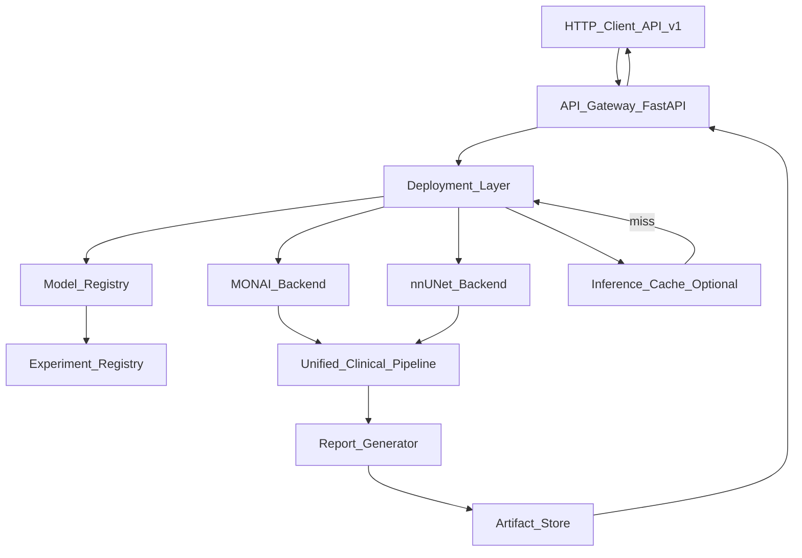
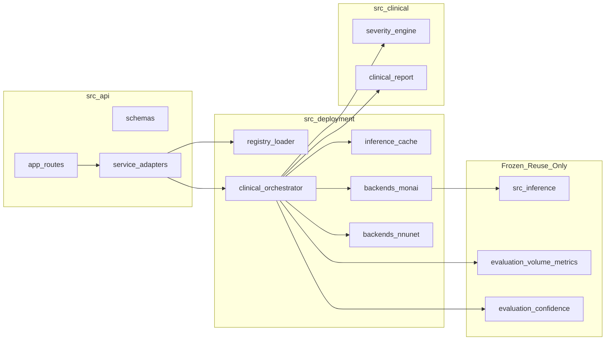
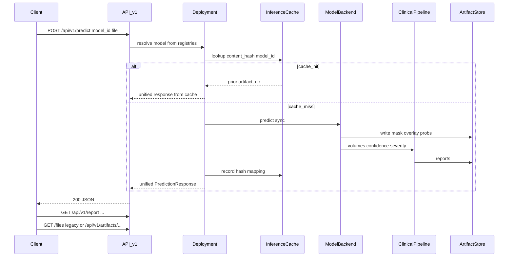

# Phase C — Production Inference Platform Architecture (v1.0)

**Status:** Implemented through C.4 (registries, unified inference, clinical, API v1)  
**HTTP contract (authoritative):** [`api_v1_contract.md`](api_v1_contract.md) — **clients must follow that file, not historical route sketches below**  
**Frontend UI (authoritative):** [`frontend_spa_workspace_design.md`](frontend_spa_workspace_design.md)  
**Master guide:** [`../PROJECT_MASTER_GUIDE.md`](../PROJECT_MASTER_GUIDE.md)

**Frozen research layers:** preprocessing · training · dataset · evaluation · research results · checkpoints  

This document retains **platform design intent and history**. Where it conflicts with `api_v1_contract.md` (prediction_id routes, artifact store under `reports/api_v1/`), **the contract wins**.

**Related:** [`docs/results/final_model_recommendation.md`](../results/final_model_recommendation.md), [`docs/DOCUMENTATION_INDEX.md`](../DOCUMENTATION_INDEX.md)

---

## Implementation snapshot (F0.5)

| Milestone | Status |
|-----------|--------|
| C.1 Registries | Done |
| C.2 Unified inference | Done |
| C.3 Clinical pipeline | Done (severity `not_configured`) |
| C.4 API v1 | Done |
| Frontend Next.js | Designed only — not implemented |
| Interim UI | Streamlit `frontend/app.py` |

Artifact store **as implemented:** `reports/api_v1/predictions/{prediction_id}/` + `index.json`.  
(The dated `reports/inference/YYYY-MM-DD/...` layout below remains an optional archival pattern used by some offline validation paths; API v1 does not require it.)


---

## 1. Purpose

After a stable research freeze (MONAI baseline + nnU-Net benchmark + locked evaluation + publication comparison), Version 1.0 deployment exposes trained models through a **clean, scalable inference platform**.

This document is the **source of truth** for Phase C implementation. It supersedes the draft “serving / async jobs” sketch.

### Model roles

| Role | Model ID | Checkpoint (frozen) |
|------|----------|---------------------|
| Interactive engineering model | `monai_best30h` | `checkpoints/experiment_best30h/best_model.pt` |
| Research quality model | `nnunet_fold0` | `checkpoints/nnunet_dataset501_fold0/checkpoint_best.pth` |

---

## 2. Architecture diagram



### Layer responsibilities

| Layer | Responsibility |
|-------|----------------|
| **Client** | Upload, model selection, display, download |
| **API Gateway** | Versioned HTTP (`/api/v1/*`), backward-compatible legacy routes |
| **Deployment Layer** | `src/deployment/` — registry resolution, backend invocation, cache, orchestration |
| **Model Registry** | Deployable models + metadata + capabilities |
| **Experiment Registry** | Source of truth for trained runs (metrics, configs, publication status) |
| **Backends** | MONAI / nnU-Net adapters around frozen checkpoints |
| **Unified Clinical Pipeline** | Volume → subtype → confidence → severity → report fields |
| **Report Generator** | Markdown now; PDF module in future roadmap |
| **Artifact Store** | Dated hierarchical filesystem under `reports/inference/` |

---

## 3. Module diagram



**Naming:** use `src/deployment/` (not `src/serving/`). Deployment owns exposing trained models to clients.

---

## 4. Request / response flow (synchronous v1)



**v1 constraint:** Fully **synchronous** Request → Inference → Response.  
No `jobs.py`, Redis, Celery, or worker queue. Long-running nnU-Net calls use long HTTP timeouts / documented wait. Async job queues are **Future Work** only.

---

## 5. Experiment Registry

**Path:** `config/experiments/registry.yaml`  
**Role:** Source of truth for every trained experiment (research + deployment lineage).

### Schema (design)

```yaml
experiments:
  - experiment_id: experiment_best30h
    display_name: "MONAI V1 best30h"
    framework: monai
    checkpoint: checkpoints/experiment_best30h/best_model.pt
    config:
      experiment: config/experiments/experiment_best30h.yaml
      model: config/model.yaml
      preprocessing: config/preprocessing.yaml
    dataset: BHSD_label_192
    split: data/metadata/splits.csv
    metrics:
      test_macro_dice: 0.257375
      test_volume_error_mean_ml: 19.533
      source: reports/evaluation/experiment_best30h_eval/
    publication_status: locked_baseline
    model_card: docs/models/monai_best30h.md

  - experiment_id: nnunet_dataset501_fold0
    display_name: "nnU-Net Dataset501 fold 0"
    framework: nnunet
    checkpoint: checkpoints/nnunet_dataset501_fold0/checkpoint_best.pth
    config:
      nnunet: config/nnunet.yaml
    dataset: BHSD_label_192
    split: data/metadata/nnunet_splits_final.json
    metrics:
      test_macro_dice: 0.454723
      test_volume_error_mean_ml: 14.3178
      source: reports/evaluation/nnunet_dataset501_fold0_eval/
    publication_status: locked_comparator
    model_card: docs/models/nnunet_fold0.md
```

**Rule:** Metrics in this registry are **copied references** to already-published evaluation reports. Do not recompute or overwrite research results during deployment work.

---

## 6. Model Registry

**Path:** `config/models/registry.yaml`  
**Role:** Deployable models. **References** Experiment Registry entries.

### Categories (stable names)

| Category | Meaning |
|----------|---------|
| `interactive` | Suited for live demo / shorter runtime (e.g. MONAI) |
| `research` | Higher quality / heavier compute (e.g. nnU-Net) |

Do **not** use Fast/Slow — hardware-dependent naming is unstable.

### Model metadata (required, frontend-consumable)

| Field | Purpose |
|-------|---------|
| `model_id` | Stable API key |
| `display_name` | UI label |
| `description` | Short plain-language blurb |
| `paper` | Citation / DOI / arXiv (dataset or method) |
| `checkpoint` | Path (must match experiment) |
| `framework` | `monai` \| `nnunet` |
| `version` | Deployable version string (e.g. `v1.0`) |
| `training_dataset` | BHSD label_192 |
| `macro_dice` | Locked-test macro Dice (from experiment registry) |
| `volume_error` | Locked-test mean volume error mL |
| `speed` | Qualitative note + measured CPU latency reference |
| `limitations` | Honest limits (EDH, calibration, etc.) |
| `recommended_use` | interactive demo vs research comparison |
| `category` | `interactive` \| `research` |
| `experiment_id` | FK → Experiment Registry |
| `enabled` | Deploy flag |
| `default` | One interactive default (`monai_best30h`) |

### Capability metadata (required)

| Capability | Meaning |
|------------|---------|
| `supports_overlay` | Slice / 3D overlay artifacts |
| `supports_volume` | Native-space mL tables |
| `supports_confidence` | Study / class confidence |
| `supports_multiclass` | 6-class ICH subtypes |
| `supports_severity` | Severity engine applied when rules active |
| `supports_uncertainty` | Explicit uncertainty maps (v1: false for both) |

Frontend enables panels from capabilities, not hardcoded model names.

### Example binding

```yaml
models:
  - model_id: monai_best30h
    experiment_id: experiment_best30h
    category: interactive
    version: "1.0"
    default: true
    capabilities:
      supports_overlay: true
      supports_volume: true
      supports_confidence: true
      supports_multiclass: true
      supports_severity: true   # pipeline runs; rules may be not_configured
      supports_uncertainty: false

  - model_id: nnunet_fold0
    experiment_id: nnunet_dataset501_fold0
    category: research
    version: "1.0"
    default: false
    capabilities:
      supports_overlay: true
      supports_volume: true
      supports_confidence: true
      supports_multiclass: true
      supports_severity: true
      supports_uncertainty: false
```

---

## 7. Unified clinical output schema

Same envelope for every backend:

```text
InferenceClinicalResult
├── model_id, display_name, category, framework, version
├── experiment_id, checkpoint
├── scan_name, run_id, artifact_dir
├── timing.processing_time_sec, cache_hit
├── geometry.shape, spacing
├── segmentation.classes_present
├── volume.total_volume_ml, per_class[], volume_report[]
├── confidence.study, per_class, histogram
├── severity.status|tier|factors|citations|disclaimer
├── capabilities (echo of model capabilities)
└── artifacts.{mask, overlay, summary, confidence, volume_csv, report_md, clinical_report_md}
```

---

## 8. Artifact store layout

**Replace** `reports/api/{job_id}/` for new deployment runs.

```text
reports/inference/
  YYYY-MM-DD/
    {scan_name}/
      {model_id}/
        prediction_mask.nii.gz
        overlay.png
        prediction_overlay_3d.png
        probabilities.npz
        prediction_summary.json
        confidence.json
        volume_report.csv
        prediction_report.md
        clinical_report.md
        meta.json              # hash, model_id, experiment_id, timestamps
```

**Benefits:** date-based archival, per-scan browsing, multi-model side-by-side folders without job-ID opacity.

**Legacy:** Existing `reports/api/` artifacts remain readable during migration; new writes use the new tree. Legacy download routes map paths via `meta` or a thin compatibility shim (design only).

---

## 9. Inference cache (design)

**Goal:** Optional, transparent reuse when the same CT bytes + same `model_id` are requested again.

```text
Upload bytes → SHA-256 content_hash
Lookup: reports/inference/_cache/index.json
  { content_hash, model_id } → artifact_dir

hit  → load prior meta + artifacts; skip backend predict
miss → run inference; write artifacts; update index
```

| Property | Design |
|----------|--------|
| Location | `reports/inference/_cache/index.json` (+ optional SQLite later) |
| Key | `(content_hash, model_id)` |
| Toggle | `BRAIN_HEMORRHAGE_INFERENCE_CACHE=1` (default off until validated) |
| Invalidation | Delete cache entry or change model version / checkpoint path |
| Transparency | Response includes `cache_hit: true|false` |

No distributed cache in v1.

---

## 10. Clinical pipeline & severity

```text
Prediction → Volume (native mL) → Subtype → Confidence → Severity Engine → Clinical Report
```

- Reuse frozen evaluation helpers for volume/confidence where possible.
- **Severity:** `config/clinical/severity_rules.yaml` starts as `status: not_configured`.  
  **Do not invent thresholds.** Activate only after `docs/clinical/severity_literature_review.md` is frozen.
- Markdown clinical report in v1; **PDF module is Future Work** (see §14).

---

## 11. API design

### Versioned surface (canonical — see `api_v1_contract.md`)

| Method | Path | Purpose |
|--------|------|---------|
| `GET` | `/api/v1/health` | Liveness + versions + models |
| `GET` | `/api/v1/models` | Registry metadata + capabilities |
| `POST` | `/api/v1/predict` | Sync inference (`model_id` optional → default interactive) |
| `GET` | `/api/v1/report/{prediction_id}` | Clinical/markdown report |
| `GET` | `/api/v1/artifacts/{prediction_id}` | Artifact listing |
| `GET` | `/api/v1/artifacts/{prediction_id}/{filename}` | Artifact download |

> **Note:** Earlier drafts listed query-style report URLs and `{date}/{scan}/{model}` artifact paths. Those were **not** implemented. Do not build clients against them.

### Backward compatibility (migration window)

| Legacy | Behavior |
|--------|----------|
| `GET /health`, `POST /predict`, `GET /files/{job_id}/...` | Still present in `src/api/app.py` for interim Streamlit; **deprecated for new work** |

No async job endpoints in v1.

### Predict contract

- Multipart: `file` required, `mask` optional, `model_id` optional.
- Always HTTP **200** on success (sync), including research models (may take minutes on CPU).
- Additive JSON fields: `model_id`, `category`, `capabilities`, `severity`, `cache_hit`, `artifact_dir`.

---

## 12. Frontend integration

| Feature | Design |
|---------|--------|
| Upload | Unchanged UX |
| Model selector | Built from `GET /api/v1/models` (`display_name`, `category`, metrics, limitations) |
| Capabilities | Enable/disable overlay, volume, confidence, severity panels dynamically |
| Progress | Sync spinner / elapsed timer (no job polling in v1) |
| Artifacts | Prefer `/api/v1/artifacts/...`; fall back to legacy during migration |
| Severity | Show configured tier or “not configured” disclaimer |
| Report download | `/api/v1/report/{prediction_id}` + markdown; PDF later |

---

## 13. Deployment plan

| Target | Approach |
|--------|----------|
| **Local demo** | venv; `uvicorn api.v1.app:app`; default interactive model; optional nnunetv2; interim Streamlit or raw HTTP |
| **Docker** | Future — see roadmap |
| **Cloud (future)** | Same API contract; optional GPU for research model |

Compose profiles: `interactive` (default), `research` (adds nnU-Net deps).

---

## 14. Final proposed folder structure

```text
BrainHemorrhageAI/
├── config/
│   ├── experiments/
│   │   ├── registry.yaml              # NEW — experiment source of truth
│   │   ├── experiment_best30h.yaml    # frozen
│   │   ├── experiment_001.yaml        # deprecated
│   │   └── experiment_sanity.yaml
│   ├── models/
│   │   └── registry.yaml              # NEW — deployable models → experiments
│   ├── clinical/
│   │   └── severity_rules.yaml        # NEW — not_configured until literature freeze
│   ├── model.yaml                     # frozen training model cfg
│   ├── preprocessing.yaml             # frozen
│   ├── nnunet.yaml                    # frozen
│   └── ...
├── src/
│   ├── research/                      # scientific workflow utilities (frozen role)
│   ├── dataset/                       # frozen loaders
│   ├── preprocessing/                 # frozen
│   ├── training/                      # frozen
│   ├── evaluation/                    # frozen metrics / locked-test tools
│   ├── inference/                     # frozen MONAI scan pipeline (wrapped by deployment)
│   ├── deployment/                    # NEW — expose trained models
│   │   ├── registry.py
│   │   ├── clinical_orchestrator.py
│   │   ├── inference_cache.py
│   │   └── backends/
│   │       ├── base.py
│   │       ├── monai_backend.py
│   │       └── nnunet_backend.py
│   ├── clinical/                      # NEW — severity + clinical report
│   │   ├── severity_engine.py
│   │   └── report.py
│   ├── api/                           # gateway; versioned routes + legacy shims
│   ├── nnunet_prep/                   # frozen conversion
│   └── visualization/
├── frontend/                          # Interim Streamlit only
├── web/                               # Planned Next.js app (not created until F1)
├── reports/
│   ├── inference/                     # NEW layout (dated / scan / model)
│   ├── evaluation/                    # frozen research eval outputs
│   ├── experiments/                   # frozen
│   └── api/                           # legacy (migration / read-only)
├── checkpoints/                       # frozen weights
├── docs/
│   ├── platform/
│   │   └── phase_c_inference_platform.md   # this document
│   ├── clinical/
│   │   └── severity_literature_review.md   # gate (authored before thresholds)
│   ├── architecture/                  # frozen research designs
│   ├── results/                       # frozen publication metrics
│   ├── models/                        # model cards
│   └── ...
├── docker/                            # NEW for v1 packaging
│   ├── Dockerfile.api
│   ├── Dockerfile.ui
│   └── docker-compose.yml
└── notebooks/
```

**Separation principle**

| Tree | Owns |
|------|------|
| `src/research` + `docs/research` + `docs/results` | Science (frozen) |
| `src/deployment` + `config/models` | Production model exposure |
| `src/clinical` + `config/clinical` | Rule-based clinical layer |
| `src/api` + `frontend` | Interface |
| `reports/inference` | Runtime artifacts |
| `config/experiments/registry.yaml` | Experiment lineage |

---

## 15. Migration plan

| Step | Change | Compatibility |
|------|--------|----------------|
| M0 | Adopt this architecture doc; no code | N/A |
| M1 | Add experiment + model registry YAML (data only) | No runtime change |
| M2 | Implement `src/deployment` + MonaiBackend; write to new artifact tree | Legacy `/predict` still works |
| M3 | Mount `/api/v1/*`; keep legacy routes as shims | Old Streamlit works |
| M4 | Clinical pipeline + severity `not_configured` | Additive fields |
| M5 | Frontend → `/api/v1/models` + capabilities | Prefer v1 URLs |
| M6 | NnUNetBackend (sync, long timeout) | Research category selectable |
| M7 | Optional inference cache behind env flag | Transparent |
| M8 | Docker compose | Documented local/cloud path |
| M9 | Deprecate legacy `/files/{job_id}` after UI migrates | Announce in release notes |

**Never:** retrain, edit frozen eval metrics, invent severity thresholds, add job queues in v1.

---

## 16. Future roadmap

| Item | Notes |
|------|-------|
| Async job queue | Redis/Celery/K8s workers — **not** v1 |
| PDF clinical report module | Generate from same clinical schema as Markdown |
| GPU cloud worker | Research model offload; same `/api/v1/predict` contract |
| Severity literature freeze | Fill YAML from cited sources only |
| Dual-model single request | Optional compare mode (two artifact dirs) |
| Uncertainty maps | When `supports_uncertainty: true` |
| Auth / multi-tenant | Post-v1.0 hardening |

---

## 17. Severity literature gate (reminder)

Experiment protocol states severity threshold literature is **not complete**. Architecture supports the engine; numeric rules remain unset until a dedicated freeze review exists. This is intentional, not an omission.

---

## 18. Implementation readiness checklist

- [x] Deployment naming (`src/deployment`)
- [x] Synchronous v1 (no jobs queue)
- [x] Dated artifact layout
- [x] API versioning + legacy shims
- [x] Model metadata + capabilities
- [x] Experiment registry → model registry
- [x] Optional inference cache design
- [x] Interactive / Research categories
- [x] PDF deferred to roadmap
- [x] Clear research vs deployment folder split

**This document is the FINAL architecture for Version 1.0 deployment implementation.**
